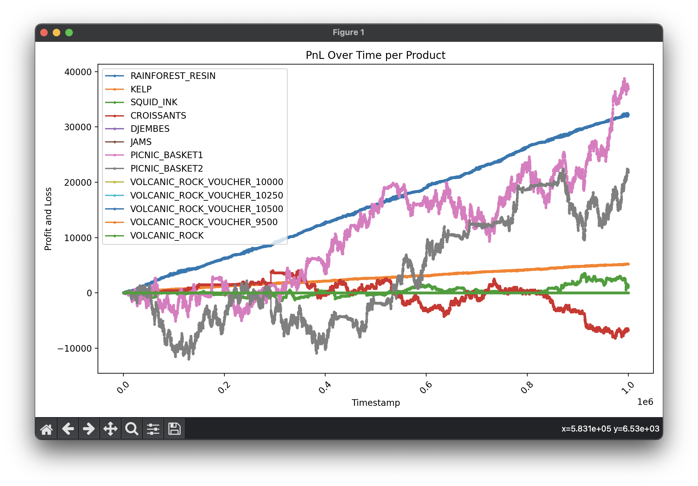
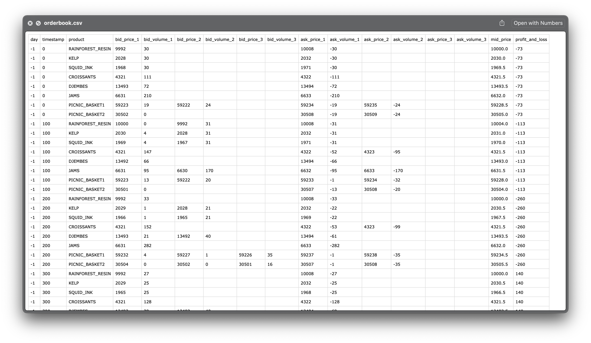

# :beach_umbrella:  IMC Prosperity Backtesting Engine  :palm_tree:
A powerful all-in-one algorithm development environment for IMC Prosperity 3 — featuring a robust backtesting engine, rich visualization tools, in-depth strategy analysis, and a flexible grid search framework.


## Backtest Output

The backtest output is stored in the `results/round-x` directory and includes the following three files:

1. **`combined_results.log`** – A log file that exactly replicates the format of official logs.
2. **`pnl_over_time.png`** – A plot of PnL over time.

3. **`orderbook.csv`** – A CSV file containing the order book and PnL at every timestamp.

4. **`trade_history.csv`** – A CSV file containing the history of all of *your own* trades.


## How to Use

To run the backtester from the command line, run the command `python main.py` followed by the following command-line arguments *in order*. If one or more arguments are missing, the flags are interpreted based on their positions and the remaining parameters are set to default values. If no arguments are provided, it defaults to testing `algorithms/algo.py` on round 0 data. For meaningful results, the first two arguments (round number and algorithm path) are usually needed.

1. **Day number**  
   - **Description:** the DAY of data to backtest on (NOT ROUND).
   - **Constraints:** integer between 0 and 2 (inclusive).
   - **Default:** `0`
2. **Algorithm path**  
   - **Description:** the file path to your algorithm.
   - **Constraints:** valid file path.
   - **Default:** `algorithms/algo.py` (an empty placeholder).
3. **Log length**  
   - **Description:** the length of the logs.
   - **Constraints:** positive integer.
   - **Default:** `None` (logs everything).
4. **Verbose**  
   - **Description:** determines whether to print detailed information to the command line.
   - **Constraints:** accepts one of: `0`, `1`, `"true"`, `"false"`, `"yes"`, `"no"`, `"是"`, `"否"` (`是` and `否` work!).
   - **Default:** `否`

## Example Commands

Execute these commands from the project root repository:

```bash
python main.py 1 algorithms/monkeys_eat_bananas.py

python main.py 3 algorithms/猴子吃香蕉.py 314 1

python main.py 5 algorithms/啦啦啦啦啦.py 100 否
```
